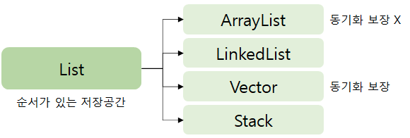

# List Interface

## 📁 목차

1. [List 계층 구조](#-list-계층-구조)
2. [List의 주요 특징](#-list의-주요-특징)
   - [순서와 인덱스](#-순서와-인덱스)
   - [중복 허용](#-중복-허용)
   - [가변성 (Dynamic Sizing)](#-가변성-dynamic-sizing)
   - [빈 공간 불허](#-빈-공간-불허)
3. [List Interface 주요 메서드](#-list-interface-주요-메서드)
   - [요소 추가](#-요소-추가)
   - [요소 제거](#-요소-제거)
   - [요소 접근 및 수정](#-요소-접근-및-수정)
   - [요소 검색](#-요소-검색)
   - [부분 리스트](#-부분-리스트)
   - [반복자](#-반복자)
   - [정렬](#-정렬)
4. [주요 구현체들](#-주요-구현체들)
   - [ArrayList](#arraylist)
   - [LinkedList](#linkedlist)
   - [Vector](#vector)
   - [Stack](#stack)
5. [사용 시나리오](#-사용-시나리오)
   - [ArrayList 사용 권장](#arraylist-사용-권장)
   - [LinkedList 사용 권장](#linkedlist-사용-권장)
   - [Vector 사용 권장](#vector-사용-권장)
   - [Stack 사용 권장](#stack-사용-권장)
6. [관련 문서](#-관련-문서)

---

`List Interface`는 Collection Interface를 상속받는 인터페이스로, **순서가 있는 저장공간**을 제공하는 컬렉션을 구현하는데 사용합니다.

## 🏗️ List 계층 구조

```
Collection
    ↓
   List
    ├── ArrayList (동기화 보장 X)
    ├── LinkedList (동기화 보장 X)
    ├── Vector (동기화 보장)
    └── Stack (동기화 보장)
```


## ✨ List의 주요 특징

### 🔢 순서와 인덱스
- **저장 순서가 유지되는 컬렉션**을 구현하는데 사용
- **배열과 마찬가지로 index로 요소에 접근** 가능
- 인덱스는 0부터 시작

### 🔄 중복 허용
- **같은 요소의 중복 저장을 허용**
- 동일한 객체를 여러 번 저장할 수 있음

### 📏 가변성 (Dynamic Sizing)
- **리스트와 배열의 가장 큰 차이**는 리스트는 **자료형 크기가 고정이 아닌 데이터의 양에 따라 동적으로 늘어난다 줄어들 수 있다**는 점이다. (가변성)
- 런타임에 크기 조절 가능

### 🚫 빈 공간 불허
- **요소 사이에 빈 공간을 허용하지 않아** 삽입, 삭제 할 때마다 **배열 이동이 일어난다.**
- 연속적인 데이터 저장 구조

## 🔧 List Interface 주요 메서드

`List Interface`는 Collection Interface의 모든 메서드를 상속받으며, 추가로 인덱스 기반 접근 메서드들을 제공한다.

### ➕ 요소 추가
| 메서드 | 설명 |
|--------|------|
| `void add(int index, Object element)` | 지정된 위치(index)에 객체(element) 또는 컬렉션에 포함된 객체들을 추가 |
| `boolean addAll(int index, Collection c)` | 지정된 위치(index)에 컬렉션의 모든 요소들을 추가 |

### ➖ 요소 제거
| 메서드 | 설명 |
|--------|------|
| `Object remove(int index)` | 지정된 위치(index)에 있는 객체를 삭제하고 삭제된 객체를 반환 |

### 🔍 요소 접근 및 수정
| 메서드 | 설명 |
|--------|------|
| `Object get(int index)` | 지정된 위치(index)에 있는 객체를 반환 |
| `Object set(int index, Object element)` | 지정된 위치(index)에 객체(element)를 저장 |

### 🔎 요소 검색
| 메서드 | 설명 |
|--------|------|
| `int indexOf(Object o)` | 지정된 객체의 위치(index)를 반환(순방향) |
| `int lastIndexOf(Object o)` | 지정된 객체의 위치(index)를 반환(역방향) |

### 📋 부분 리스트
| 메서드 | 설명 |
|--------|------|
| `List subList(int fromIndex, int toIndex)` | 지정된 범위(from ~ to)에 있는 객체를 반환 |

### 🔁 반복자
| 메서드 | 설명 |
|--------|------|
| `ListIterator listIterator()` | List의 객체에 접근할 수 있는 ListIterator를 반환 |
| `ListIterator listIterator(int index)` | 지정된 위치부터 시작하는 ListIterator를 반환 |

### 🔧 정렬
| 메서드 | 설명 |
|--------|------|
| `void sort(Comparator c)` | 지정된 비교자(comparator)로 List를 정렬 |

## 🏷️ 주요 구현체들

### ArrayList
- **[ArrayList](./ArrayList.md)** - 동적 배열 구조, 빠른 랜덤 접근

### LinkedList  
- **[LinkedList](./LinkedList.md)** - 이중 연결 리스트 구조, 빠른 삽입/삭제

### Vector
- **[Vector](./Vector.md)** - 동기화된 ArrayList, 멀티스레드 환경 지원

### Stack
- **[Stack](./Stack.md)** - LIFO 구조, Vector를 상속받음

## 💡 사용 시나리오

### ArrayList 사용 권장
- 읽기 작업이 많은 경우
- 랜덤 접근이 빈번한 경우
- 단일 스레드 환경

### LinkedList 사용 권장
- 삽입/삭제 작업이 많은 경우
- 리스트의 중간 부분 수정이 빈번한 경우
- Queue나 Deque로도 사용해야 하는 경우

### Vector 사용 권장
- 멀티스레드 환경에서 동기화가 필요한 경우
- 레거시 코드와의 호환성이 필요한 경우

### Stack 사용 권장
- LIFO 방식의 데이터 처리가 필요한 경우
- 함수 호출 스택, 역순 처리 등

## 📚 관련 문서

- [Collection Interface](../Core-Interfaces/Collection-Interface.md)
- [ArrayList](./ArrayList.md)
- [LinkedList](./LinkedList.md)
- [Vector](./Vector.md)
- [Stack](./Stack.md)
- [ListIterator vs Iterator](../Core-Interfaces/ListIterator.md)

## 🔗 상위 개념
- [Java Collection Framework](../Java%20Collection%20Framework%20개요.md)
- [Collection Interface](../Core-Interfaces/Collection-Interface.md)
