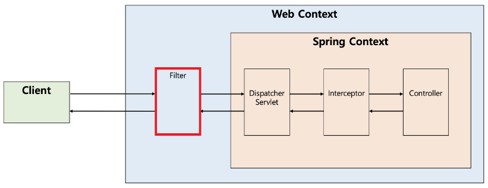
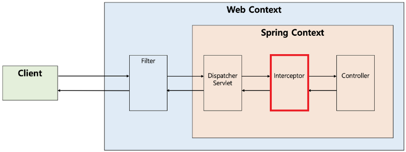

# 필터와 인터셉터

---

개발을 하다 보면 공통적으로 처리해야 할 업무들이 많다

공통 업무와 관련된 코드를 페이지마다 작성한다면 중복 코드가 많아지고, 프로젝트의 단위가 커질수록 서버에 부하를 줄 수도 있으며, 소스 관리도 되지 않는다.

Spring은 공통적으로 여러 작업을 처리함으로써 중복된 코드를 제거할 수 있는 다음과 같은 기능들을 지원한다.

1. [**필터(Filter)**](https://www.notion.so/1453d99b7d5080f4a6bae33dd3238bf9?pvs=21)
2. [**인터셉터(Interceptor)**](https://www.notion.so/1453d99b7d5080f4a6bae33dd3238bf9?pvs=21)
3. [**관점 지향 프로그래밍(AOP, Aspect Oriented Programming)**](https://www.notion.so/AOP-Aspect-Oriented-Programming-1453d99b7d508083b0a9d877694d0353?pvs=21)

Spring에서 사용되는 위 3가지 기능들은 모두 **어떤 행동을 하기 전에 먼저 실행되거나, 실행한 후에 추가적인 행동을 할 때 사용되는 기능**들이다.

---

## 필터

필터를 **요청과 응답을 거른 뒤 정제하는 역할**을 한다.

**디스패처 서블릿 이전 단계에서 요청과 응답을 처리하거나 가공**할 수 있다.

즉, 스프링 컨테이너가 아닌 **톰캣과 같은 웹 컨테이너에 의해 관리**가 되는 것이고, 스프링 범위 밖에서 처리된다. (스프링 빈으로 등록 가능)



---

### 필터의 메소드 종류

필터를 사용하기 위해서는 `javax.servelt`의 `Filter` 인터페이스를 구현해야하며, 아래와 같은 메소드를 가진다.

```java
public interface Filter { 
  public default void init(FilterConfig filterConfig) throws ServletException {}
	
  public void doFilter(
    ServletRequest reqeust,
    ServletResponse response,
    FilterChain chain
  ) throws IOException, ServletException;
	
  public default void destroy() {}
}
```

---

### `init()`

필터 객체를 초기화하고 서비스에 추가하기 위한 메소드이다.
웹 컨테이너가 1회 `init()`을 호출하여 필터 객체를 초기화하면 이후 요청들은 `doFilter()`를 통해 처리된다.

---

### `doFilter()`

url 패턴에 맞는 모든 HTTP 요청이 디스패처 서블릿으로 전달되기 전에 웹 컨테이너에 의해 실행되는 메소드이다.

`doFilter()`의 파라미터로 FilterChain이 있는데, FilterChain의 `doFilter()`를 통해 다음 대상으로 요청을 전달할 수 있게 된다.

`chain.doFilter()`로 전, 후에 필요한 처리 과정을 넣어줌으로써 원하는 처리를 진행할 수 있다.

---

### `destroy()`

필터 객체를 제거하고 사용하는 자원을 반환하기 위한 메소드이다.

웹 컨테이너가 1회 `destroy()`를 호출하여 필터 객체를 종료하면 이후에는 `doFilter()`에 의해
처리되지 않는다.

---

## 인터셉터(Interceptor)

**요청을 작업 전, 후로 가로챈다.**

**Handler**(컨트롤러 메소드) 호출 전, 후에 끼어들어 **요청과 응답을 참조하거나 가공할 수 있는 기능을 제공**한다.

웹 컨테이너에서 동작하는 필터와 달리 인터셉터는 **스프링 컨텍스트에서 동작**한다.

디스패처 서블릿이 핸들러 매핑을 통해 컨트롤러를 찾도록 요청하는데, 그 결과로 실행 체인(HandlerExecutionChain)을 돌려준다.

여기서 1개 이상의 인터셉터가 등록되어 있다면 순차적으로 인터셉터들을 거쳐 컨트롤러가
실행되도록 하고, 인터셉터가 없다면 바로 컨트롤러를 실행한다. 

실제로 인터셉터가 직접 컨트롤러로 요청을 위임하는 것은 아니다.



---

### 인터셉터의 메소드 종류

인터셉터를 추가하기 위해서는 `org.springframework.web.servlet`의 `HandleInterceptor` 인터페이스를 구현해야하며, 아래와 같은 메소드를 가진다.

```java
public interface HandlerInterceptor { 
  default boolean preHandle(
    HttpServletRequest request,
    HttpServletResponse response,
    Object handler
  ) throws Exception {
    return true;
  }
	
  default void postHandle(
    HttpServletRequest reqeust,
    HttpServletResponse response,
    Object handler
    @Nullable ModelAndView modelAndView
  ) throws Exception {}
	
  default void afterCompletion(
    HttpServletRequest request,
    HttpServletResponse response,
    Object handler,
    @Nullable Exception ex
  ) throws Exception {}
}
```

---

### `preHandle()`

컨트롤러가 호출되기 전에 실행된다.

**컨트롤러 이전에 처리해야 하는 전처리 작업**이나 **요청 정보를 가공하거나 추가하는 경우에 사용**할 수 있다.

---

### `postHandle()`

컨트롤러가 호출된 후에 실행된다. (View 렌더링 전)

**컨트롤러 이후에 처리해야 하는 후처리 작업**이 있을 때 사용할 수 있다. 이 메소드는 컨트롤러가 반환하는 ModelAndView 타입의 정보가 제공되는데, 최근에는 JSON 형태로 데이터를 제공하는  RestAPI 기반의 컨트롤러(`@RestController`)를 만들면서 자주 사용되지 않는다.

---

### `afterCompletion()`

모든 뷰에서 **최종 결과를 생성하는 일을 포함해 모든 작업이 완료된 후에 실행**된다. (View 렌더링 후)

요청 처리 중에 사용한 리소스를 반환할 떄 사용할 수 있다.

---

### 인터셉터와 AOP 비교

인터셉터 대신에 컨트롤러에 적용할 부가 기능을 어드바이스로 만들어 AOP를 적용할 수도 있다.

하지만 다음과 같은 이유들로 컨트롤러의 호출 과정에 적용되는 부가 기능들은 인터셉터를 사용하는 편이 낫다.

1. **컨트롤러는 타입과 실행 메소드가 모두 제각각이라 포인트컷의 작성의 어렵다.**
2. **컨트롤러는 파라미터나 리턴값이 일정하지 않다.**

즉, 타입과 호출 패턴이 정해져 있지 않기 때문에 컨트롤러에 AOP를 적용하려면 번거로운 부가 작업들이 생기게 된다.

---

## 필터와 인터셉터의 차이 및 비교

### Request, Response 객체 조작 가능 여부

필터는 Request와 Response를 조작할 수 있지만, 인터셉터는 조작할 수 없다.

```java
public class CustomFilter implements Filter {

  @Override
  public void doFilter(
    ServletRequest request,
    ServletResponse response,
    FilterChain chain
  ) throws IOException, ServletException {
		
    # 원하는 request, response를 넣어줄 수 있다.
    chain.doFilter(request, response)
  }
}
```

필터가 다음 필터를 호출하기 위해서는 필터 체이닝(다음 필터 호출)을 해줘야 한다. 이때 `request`, `response` 객체를 넘겨주므로 원하는 `request`, `response` 객체를 넣어줄 수 있다.

```java
public class CustomInterceptor implements HandlerInterceptor {
    
  public boolean preHandle(
    HttpServletRequest request,
    HttpServletResponse response,
    Object handler
  ) throws Exception {
    # request, response를 변경할 수 없고 boolean 값만 반환 가능
    return true;
  }
}
```

디스패처 서블릿이 여러 인터셉터 목록을 가지고 있고, 순차적으로 실행시킨다. 그리고 `true`를 반환하면 다음 인터셉터가 실행되거나 컨트롤러로 요청이 전달되며, `false`가 반환되면 요청이 중단된다.

따라서 다른 `request`, `response` 객체를 넘겨줄 수 없다.

---

### 필터와 인터셉터의 사용 사례

**필터의 사용 사례**

- 보안 및 인증, 인가 관련 작업
    - JWT 유효성 검사
- 모든 요청에 대한 로깅 또는 검사
- 이미지, 데이터 압축 및 문자열 인코딩
    - UTF-8 설정
- Spring과 분리되어야 하는 기능

필터는 기본적으로 **스프링과 무관하게 전역적으로 처리해야 하는 작업들을 처리**할 수 있다.

필터는 인터셉터보다 앞단에서 동작하기 때문에 보안 검사(XSS 방어 등)를 하여 올바른 요청이 아닐 경우 차단할 수 있다. 그러면 스프링 컨테이너까지 요청이 전달되지 못하고 차단되므로 안정성을 더욱 높일 수 있다.

또한, 필터는 이미지나 데이터의 압축, 문자열 인코딩과 같이 웹 어플리케이션에 전반적으로 사용되는 기능을 구현하기에 적당하다.

**인터셉터의 사용 사례**

- 세부적인 보안 및 인증, 인가 공통 작업
- API 호출에 대한 로깅 또는 검사
- 컨트롤러로 넘겨주는 정보(데이터)의 가공

인터셉터에서는 **클라이언트의 요청과 관련되어 전역적으로 처리해야 하는 작업들을 처리**할 수 있다.

대표적으로 세부적으로 적용해야 하는 인증이나 인가와 같이 예를 들어 특정 그룹의 사용자는 어떤 기능을 사용하지 못하는 경우가 있는데, 이러한 작업들은 컨트롤러로 넘어가기 전에 검사해야 하므로 인터셉터가 처리하기에 적합하다.

또한 필터와 다르게 인터셉터는 `HttpServletRequest`나 `HttpServletResponse` 등과 같은 객체를 제공받으므로 객체 자체를 조작할 수는 없다.

대신 해당 객체가 내부적으로 갖는 값은 조작할 수 있으므로 컨트롤러로 넘겨주기 위한 정보를 가공하기에 용이하다.

예를 들어 JWT를 파싱해서 컨트롤러에게 사용자의 정보를 제공하도록 가공할 수 있다.

그 외에도 여러 목적으로 API 호출에 대한 정보들을 기록해야 하는 상황에 `HttpServletRequest`나 `HttpServletResponse`를 제공해주는 인터셉터는 클라이언트의 IP나 요청 정보들을 기록하기에 용이하다.

---

### 정리

| **구분** | **필터** | **인터셉터** |
| --- | --- | --- |
| **동작 시점** | 디스패처 서블릿 이전 | 디스패처 서블릿 이후 |
| **기술 스펙** | Servlet 스펙 기반 | Spring MVC 기반 |
| **관리되는 컨테이너** | 웹 컨테이너 | 스프링 컨테이너 |
| **작동 범위** | 모든 요청(정적 리소스 포함) | Spring MVC 핸들러(컨트롤러)와 관련된 요청만 |
| **주요 용도** | - 요청/응답 전처리
- 보안
- 로깅
- 이미지/데이터 압축 및 문자열 인코딩 | - 세부적인 보안 및 인증/인가 공통
  작업
- 컨트롤러 호출 전, 후 로직 처리
- 컨트롤러로 넘겨주는 데이터의
  가공 |
| **Spring 빈 접근** | 불가능 | 가능 |
| **Request/Response
객체 조작 가능 여부** | 가능 | 불가능 |

필터와 인터셉터 모두 비즈니스 로직과 분리되어 특정 요구사항(보안, 인증, 인코딩 등)을 만족시켜야 할 때 적용한다.

**필터**는 특정 요청과 컨트롤러에 관계 없이 **전역적으로 처리해야 하는 작업이나 웹 어플리케이션에 전반적으로 사용되는 기능을 구현할 때 적용**하고,

**인터셉터**는 클라이언트의 요청과 관련된 작업에 대해 **추가적인 요구사항을 만족해야 할 때 적용**한다.

---