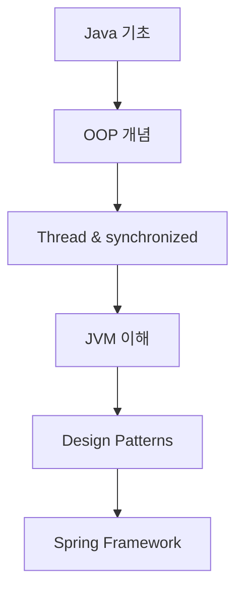

# 📚 Java Study Repository

Java 프로그래밍 언어의 핵심 개념과 디자인 패턴을 정리한 학습 저장소입니다.

## 📑 목차

### 🎨 Design Pattern
Java에서 자주 사용되는 디자인 패턴들을 정리한 자료입니다.

| 패턴명 | 타입 | 설명 | 링크 |
|--------|------|------|------|
| **Singleton Pattern** | 생성 패턴 | 애플리케이션에서 하나의 인스턴스만 존재하도록 보장하는 패턴 | [📖 자세히 보기](./Design%20Pattern/Singleton%20Pattern.md) |
| **Facade Pattern** | 구조 패턴 | 복잡한 서브시스템을 단순한 인터페이스로 감싸는 패턴 | [📖 자세히 보기](./Design%20Pattern/Facade%20Pattern.md) |

---

## ✅ TODO 목록

### 🎯 진행 예정인 디자인 패턴

- [ ] **Factory Pattern** (팩토리 패턴)
- [ ] **Observer Pattern** (옵저버 패턴)
- [ ] **Strategy Pattern** (전략 패턴)
- [ ] **Command Pattern** (커맨드 패턴)
- [ ] **Adapter Pattern** (어댑터 패턴)
- [ ] **Decorator Pattern** (데코레이터 패턴)
- [ ] **Template Method Pattern** (템플릿 메서드 패턴)
- [ ] **Builder Pattern** (빌더 패턴)

### 🧵 Java 핵심 개념 정리

- [ ] **Thread** (스레드)
  - [ ] Thread 생성과 실행
  - [ ] Thread 생명주기
  - [ ] Thread Pool 활용
  - [ ] CompletableFuture와 비동기 프로그래밍
  - [ ] ExecutorService와 스레드 풀 관리

- [ ] **synchronized 키워드**
  - [ ] 동기화의 필요성과 문제점
  - [ ] synchronized method vs synchronized block
  - [ ] wait(), notify(), notifyAll()
  - [ ] Lock 인터페이스와 ReentrantLock
  - [ ] volatile 키워드
  - [ ] 데드락(Deadlock) 이해와 방지

- [ ] **JVM** (Java Virtual Machine)
  - [ ] JVM 메모리 구조 (Heap, Stack, Method Area, PC Register)
  - [ ] 가비지 컬렉션 (GC) 동작 원리와 알고리즘
  - [ ] 클래스 로딩 과정 (Loading, Linking, Initialization)
  - [ ] JIT 컴파일러와 성능 최적화
  - [ ] JVM 튜닝과 메모리 분석

### 🚀 추가 학습 주제

- [ ] **Java Collections Framework**
  - [ ] List, Set, Map 구현체들의 특징
  - [ ] Iterator와 ListIterator
  - [ ] Collections 유틸리티 클래스
  - [ ] 동시성 컬렉션 (ConcurrentHashMap, etc.)

- [ ] **Java 8+ 새로운 기능들**
  - [ ] Lambda Expression과 Method Reference
  - [ ] Stream API와 함수형 프로그래밍
  - [ ] Optional 클래스 활용
  - [ ] CompletableFuture와 비동기 프로그래밍

- [ ] **Spring Framework 연관 개념**
  - [ ] IoC (Inversion of Control)와 DI (Dependency Injection)
  - [ ] AOP (Aspect-Oriented Programming)
  - [ ] Spring Bean 생명주기

---

## 🏗️ 디자인 패턴 분류

### 생성 패턴 (Creational Patterns)
객체 생성에 관련된 패턴들

- [x] **Singleton Pattern** - 단일 인스턴스 보장
- [ ] **Factory Pattern** - 객체 생성 로직 캡슐화
- [ ] **Builder Pattern** - 복잡한 객체의 단계별 생성
- [ ] **Abstract Factory Pattern** - 관련 객체군 생성
- [ ] **Prototype Pattern** - 객체 복제를 통한 생성

### 구조 패턴 (Structural Patterns)
클래스나 객체의 구성에 관련된 패턴들

- [x] **Facade Pattern** - 복잡한 시스템을 단순한 인터페이스로 제공
- [ ] **Adapter Pattern** - 호환되지 않는 인터페이스 연결
- [ ] **Decorator Pattern** - 객체에 동적으로 기능 추가
- [ ] **Composite Pattern** - 객체를 트리 구조로 구성
- [ ] **Proxy Pattern** - 객체에 대한 접근 제어

### 행위 패턴 (Behavioral Patterns)
객체나 클래스 사이의 알고리즘이나 책임 분배에 관련된 패턴들

- [ ] **Observer Pattern** - 객체 상태 변화 관찰
- [ ] **Strategy Pattern** - 알고리즘을 캡슐화하여 교체 가능하게 만듦
- [ ] **Command Pattern** - 요청을 객체로 캡슐화
- [ ] **Template Method Pattern** - 알고리즘의 골격 정의
- [ ] **State Pattern** - 객체의 상태에 따른 행위 변경

---

## 🎓 학습 가이드

### 1. 권장 학습 순서


#### 단계별 학습
1. **Java 기초 문법** → 변수, 제어문, 메서드, 클래스
2. **객체지향 프로그래밍** → 상속, 캡슐화, 다형성, 추상화
3. **멀티스레딩** → Thread, synchronized, concurrent 패키지
4. **JVM 동작 원리** → 메모리 구조, GC, 클래스 로딩
5. **디자인 패턴** → GoF 패턴들의 이해와 적용
6. **Spring Framework** → 실제 프로젝트에서의 패턴 활용

### 2. 각 주제별 학습 포인트

#### 🎯 Design Pattern 학습 시
- **문제 상황**: 어떤 문제를 해결하는가?
- **구조**: 클래스 다이어그램과 관계
- **구현**: 실제 Java 코드 예시
- **장단점**: 언제 사용하고 언제 피해야 하는가?
- **실제 사용 사례**: Spring, Android 등에서의 활용

#### 🧵 Thread 학습 시
- **이론**: 스레드의 개념과 필요성
- **실습**: 직접 코드 작성하며 동시성 문제 경험
- **도구**: Thread 분석 도구 활용 (JVisualVM, JProfiler)
- **패턴**: Thread Pool, Producer-Consumer 패턴

#### ⚙️ JVM 학습 시
- **구조**: 메모리 영역별 역할과 특징
- **실습**: 메모리 덤프 분석, GC 로그 분석
- **튜닝**: 실제 애플리케이션 성능 개선 경험
- **도구**: JVM 모니터링 도구 활용

---

## 📁 폴더 구조

```
Java-study/
├── README.md
├── Design Pattern/
│   ├── README.md
│   ├── Singleton Pattern.md
│   ├── Facade Pattern.md
│   └── images/
├── Thread/
│   └── (예정)
├── JVM/
│   └── (예정)
└── Collections/
    └── (예정)
```

---

## 📈 학습 진도

- **완료된 주제**: 2개 (Singleton Pattern, Facade Pattern)
- **진행 예정**: 20+ 개 주제
- **목표**: Java 백엔드 개발자로서 필수 개념 완전 정복

---

*마지막 업데이트: 2025년 1월*  
*작성자: Java 학습자*
