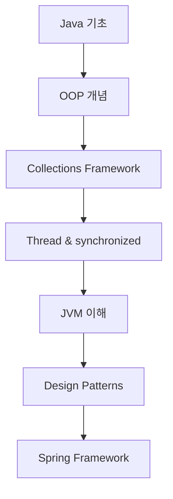

# 📚 Java Study Repository

Java 공부를 하자.

## 📑 목차

### 📚 Java 기초
프로그래밍의 기초 개념과 메모리 관리

| 주제명                                 | 분류      | 설명                                                         | 링크                                                                  |
|-------------------------------------|---------|------------------------------------------------------------|---------------------------------------------------------------------|
| **Static과 Instance  <br/>멤버의 생명주기** | 메모리  관리 | static과 instance 멤버의 메모리 로드/저장/해제 시점  <br/>및 JVM 메모리 영역 비교 | [📖 이동](./Java%20기초/메모리/Static과%20Instance%20멤버의%20생명주기.md)         |
| **다형성**                             | 객체지향    | 하나의 메소드나 클래스가 다양한 방법으로 동작하는 개념  <br/>(오버로딩, 오버라이딩)         | [📖 이동](./Java%20기초/다형성.md)                                         |
| **프레임워크  <br/> & 라이브러리**                 | 개념 정리   | 프레임워크와 라이브러리의 차이점과 역할, 사용 시기                               | [📖 이동](./Java%20기초/프레임워크%20(Framework)%20&%20라이브러리%20(Library).md) |
| **필터와 인터셉터**                        | Spring  | Spring에서 공통 업무 처리를 위한 필터와 인터셉터의  <br/>개념과 차이점              | [📖 이동](./Java%20기초/필터와%20인터셉터.md)                                    |

### 📦 Collections
Java Collection Framework의 다양한 자료구조와 인터페이스

| 주제명 | 분류 | 설명                                                       | 링크                                     |
|--------|------|----------------------------------------------------------|----------------------------------------|
| **Java Collection Framework** | 전체 구조 | JCF의 전체 구조와 List, Set, Queue, Map 인터페이스  <br/>및 구현체들의 분류 | [📖 이동](./Collections/Java%20Collection%20Framework%20개요.md) |
| **계층화된 Collections 구조** | 전체 관리 | 인터페이스와 구현체별로 계층화된 폴더 구조  <br/>및 학습 가이드 | [📖 이동](./Collections/README.md) |
| **Collection Interface** | 인터페이스 | 모든 컬렉션의 공통 메서드를 정의하는 최상위 인터페이스  <br/>(add, remove, contains 등) | [📖 이동](./Collections/Core-Interfaces/Collection-Interface.md) |
| **List Interface** | 인터페이스 | 순서가 있고 중복을 허용하는 컬렉션 인터페이스  <br/>(인덱스 기반 접근, 가변 크기) | [📖 이동](./Collections/List/List-Interface.md) |
| **ArrayList** | List | 동적 배열 기반 List 구현체  <br/>(빠른 접근, 순차적 추가/삭제 우세) | [📖 이동](./Collections/List/ArrayList.md) |
| **TreeSet** | Set | 정렬된 순서로 요소를 저장하는 Set 구현체  <br/>(이진탐색트리 기반, 자동 정렬)        | [📖 이동](./Collections/Set/TreeSet.md)        |
| **Iterator** | 인터페이스 | 컬렉션 순회를 위한 표준 인터페이스  <br/>(안전한 요소 제거, Fail-Fast 메커니즘)         | [📖 이동](./Collections/Core-Interfaces/Iterator.md) |

### 🎨 Design Pattern
자주 사용되는 디자인 패턴

| 패턴명 | 타입 | 설명 | 링크 |
|--------|------|------|------|
| **Singleton Pattern** | 생성 패턴 | 애플리케이션에서 하나의 인스턴스만 존재하도록 보장하는 패턴 | [📖 이동](./Design%20Pattern/Singleton%20Pattern.md) |
| **Facade Pattern** | 구조 패턴 | 복잡한 서브시스템을 단순한 인터페이스로 감싸는 패턴 | [📖 이동](./Design%20Pattern/Facade%20Pattern.md) |

---

## ✅ TODO 목록

### 🎯 진행 예정인 디자인 패턴

- [ ] **Factory Pattern** (팩토리 패턴)
- [ ] **Observer Pattern** (옵저버 패턴)
- [ ] **Strategy Pattern** (전략 패턴)
- [ ] **Command Pattern** (커맨드 패턴)
- [ ] **Adapter Pattern** (어댑터 패턴)
- [ ] **Decorator Pattern** (데코레이터 패턴)
- [ ] **Template Method Pattern** (템플릿 메서드 패턴)
- [ ] **Builder Pattern** (빌더 패턴)

### 🧵 Java 핵심 개념 정리

- [x] **메모리 관리**
  - [x] Static과 Instance 멤버의 생명주기
  - [ ] JVM 메모리 구조 심화
  - [ ] 가비지 컬렉션 동작 원리

- [x] **객체지향 프로그래밍**
  - [x] 다형성 (오버로딩, 오버라이딩)
  - [ ] 상속과 캡슐화
  - [ ] 추상화와 인터페이스

- [x] **Spring 기초**
  - [x] 필터와 인터셉터
  - [ ] IoC와 DI
  - [ ] AOP

- [x] **개념 정리**
  - [x] 프레임워크 vs 라이브러리
  - [ ] 컴파일 언어 vs 인터프리터 언어

- [x] **Collections Framework**
  - [x] Java Collection Framework 개요
  - [x] Collection Interface (공통 메서드)
  - [x] List Interface (순서가 있는 컬렉션)
  - [x] ArrayList (동적 배열 기반 List)
  - [x] TreeSet (정렬된 Set)
  - [x] Iterator (컬렉션 순회 인터페이스)
  - [ ] 주요 구현체들 비교 및 선택 가이드

- [ ] **Thread** (스레드)
  - [ ] Thread 생성과 실행
  - [ ] Thread 생명주기
  - [ ] Thread Pool 활용
  - [ ] CompletableFuture와 비동기 프로그래밍
  - [ ] ExecutorService와 스레드 풀 관리

- [ ] **synchronized 키워드**
  - [ ] 동기화의 필요성과 문제점
  - [ ] synchronized method vs synchronized block
  - [ ] wait(), notify(), notifyAll()
  - [ ] Lock 인터페이스와 ReentrantLock
  - [ ] volatile 키워드
  - [ ] 데드락(Deadlock) 이해와 방지

- [ ] **JVM** (Java Virtual Machine)
  - [ ] JVM 메모리 구조 (Heap, Stack, Method Area, PC Register)
  - [ ] 가비지 컬렉션 (GC) 동작 원리와 알고리즘
  - [ ] 클래스 로딩 과정 (Loading, Linking, Initialization)
  - [ ] JIT 컴파일러와 성능 최적화
  - [ ] JVM 튜닝과 메모리 분석

### 🚀 추가 학습 주제

- [ ] **Java Collections Framework**
  - [x] Java Collection Framework 개요
  - [x] Collection Interface (공통 메서드)
  - [x] List Interface (순서가 있는 컬렉션)
  - [x] ArrayList (동적 배열 기반 List)
  - [x] TreeSet (정렬된 Set)
  - [x] Iterator (컬렉션 순회 인터페이스)
  - [ ] **List 구현체들**: LinkedList, Vector, Stack
  - [ ] **Set 구현체들**: HashSet, LinkedHashSet, EnumSet
  - [ ] **Queue 구현체들**: PriorityQueue, ArrayDeque
  - [ ] **Map 구현체들**: HashMap, LinkedHashMap, TreeMap, Hashtable
  - [ ] ListIterator와 Spliterator
  - [ ] Collections 유틸리티 클래스
  - [ ] 동시성 컬렉션 (ConcurrentHashMap, etc.)

- [ ] **Java 8+ 새로운 기능들**
  - [ ] Lambda Expression과 Method Reference
  - [ ] Stream API와 함수형 프로그래밍
  - [ ] Optional 클래스 활용
  - [ ] CompletableFuture와 비동기 프로그래밍

- [ ] **Spring Framework 연관 개념**
  - [ ] IoC (Inversion of Control)와 DI (Dependency Injection)
  - [ ] AOP (Aspect-Oriented Programming)
  - [ ] Spring Bean 생명주기

---

## 🏗️ 디자인 패턴 분류

### 생성 패턴 (Creational Patterns)
객체 생성에 관련된 패턴들

- [x] **Singleton Pattern** - 단일 인스턴스 보장
- [ ] **Factory Pattern** - 객체 생성 로직 캡슐화
- [ ] **Builder Pattern** - 복잡한 객체의 단계별 생성
- [ ] **Abstract Factory Pattern** - 관련 객체군 생성
- [ ] **Prototype Pattern** - 객체 복제를 통한 생성

### 구조 패턴 (Structural Patterns)
클래스나 객체의 구성에 관련된 패턴들

- [x] **Facade Pattern** - 복잡한 시스템을 단순한 인터페이스로 제공
- [ ] **Adapter Pattern** - 호환되지 않는 인터페이스 연결
- [ ] **Decorator Pattern** - 객체에 동적으로 기능 추가
- [ ] **Composite Pattern** - 객체를 트리 구조로 구성
- [ ] **Proxy Pattern** - 객체에 대한 접근 제어

### 행위 패턴 (Behavioral Patterns)
객체나 클래스 사이의 알고리즘이나 책임 분배에 관련된 패턴들

- [ ] **Observer Pattern** - 객체 상태 변화 관찰
- [ ] **Strategy Pattern** - 알고리즘을 캡슐화하여 교체 가능하게 만듦
- [ ] **Command Pattern** - 요청을 객체로 캡슐화
- [ ] **Template Method Pattern** - 알고리즘의 골격 정의
- [ ] **State Pattern** - 객체의 상태에 따른 행위 변경

---

## 🎓 학습 가이드

### 1. 권장 학습 순서


#### 단계별 학습
1. **Java 기초 문법** → 변수, 제어문, 메서드, 클래스
2. **객체지향 프로그래밍** → 상속, 캡슐화, 다형성, 추상화
3. **Collections Framework** → List, Set, Map 등 자료구조와 Iterator
4. **멀티스레딩** → Thread, synchronized, concurrent 패키지
5. **JVM 동작 원리** → 메모리 구조, GC, 클래스 로딩
6. **디자인 패턴** → GoF 패턴들의 이해와 적용
7. **Spring Framework** → 실제 프로젝트에서의 패턴 활용

### 2. 각 주제별 학습 포인트

#### 🎯 Design Pattern 학습 시
- **문제 상황**: 어떤 문제를 해결하는가?
- **구조**: 클래스 다이어그램과 관계
- **구현**: 실제 Java 코드 예시
- **장단점**: 언제 사용하고 언제 피해야 하는가?
- **실제 사용 사례**: Spring, Android 등에서의 활용

#### 📦 Collections 학습 시
- **자료구조 특징**: 시간복잡도, 공간복잡도
- **사용 시나리오**: 언제 어떤 컬렉션을 사용할지
- **성능 비교**: 실제 성능 테스트와 벤치마크
- **Iterator 활용**: 안전한 순회와 요소 제거
- **실무 활용**: 대용량 데이터 처리 시 고려사항

#### 🧵 Thread 학습 시
- **이론**: 스레드의 개념과 필요성
- **실습**: 직접 코드 작성하며 동시성 문제 경험
- **도구**: Thread 분석 도구 활용 (JVisualVM, JProfiler)
- **패턴**: Thread Pool, Producer-Consumer 패턴

#### ⚙️ JVM 학습 시
- **구조**: 메모리 영역별 역할과 특징
- **실습**: 메모리 덤프 분석, GC 로그 분석
- **튜닝**: 실제 애플리케이션 성능 개선 경험
- **도구**: JVM 모니터링 도구 활용

---

## 📁 폴더 구조

```
Java-study/
├── README.md
├── Java 기초/
│   ├── 다형성.md
│   ├── 프레임워크 (Framework) & 라이브러리 (Library).md
│   ├── 필터와 인터셉터.md
│   ├── 메모리/
│   │   └── Static과 Instance 멤버의 생명주기.md
│   └── images/
├── Collections/
│   ├── Java Collection Framework 개요.md
│   ├── README.md
│   ├── Core-Interfaces/
│   │   ├── Collection-Interface.md
│   │   └── Iterator.md
│   ├── List/
│   │   ├── List-Interface.md
│   │   └── ArrayList.md
│   ├── Set/
│   │   └── TreeSet.md
│   ├── Queue/
│   │   └── (예정)
│   ├── Map/
│   │   └── (예정)
│   └── images/
├── Design Pattern/
│   ├── README.md
│   ├── Singleton Pattern.md
│   ├── Facade Pattern.md
│   └── images/
├── Thread/
│   └── (예정)
├── JVM/
│   └── (예정)
└── Spring/
    └── (예정)
```

---

## 📈 학습 진도

- **완료된 주제**: 13개
  - **Java 기초**: 4개 (Static/Instance 생명주기, 다형성, 프레임워크 vs 라이브러리, 필터와 인터셉터)
  - **Collections**: 7개 (JCF 개요, 계층화된 구조, Collection Interface, List Interface, ArrayList, TreeSet, Iterator)
  - **Design Pattern**: 2개 (Singleton Pattern, Facade Pattern)
- **진행 예정**: 20+ 개 주제
- **목표**: Java 백엔드 개발자로서 필수 개념 완전 정복

---

*마지막 업데이트: 2025년 1월*  
*작성자: Java 학습자*